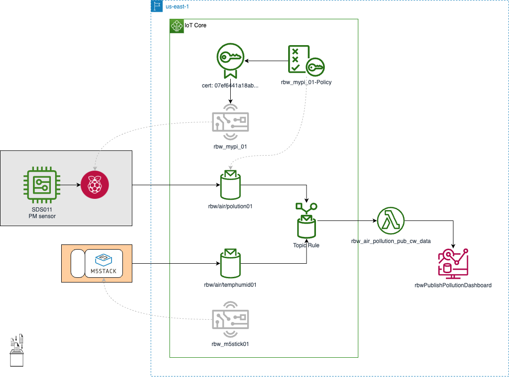

# RBW IoT Air Quality Monitor
Monitor air quality with RasperryPi

The Air Quality Standards Regulations 2010 require that concentrations of PM in the UK must not exceed:
* An annual average of 40 µg/m3 for PM10;
* A 24-hour average of 50 µg/m3 more than 35 times in a single year for PM10;
* An annual average of 20 µg/m3 for PM2.5.

(Ref: Defra)

### Solution Implementation:

    
  ---

# Links
* [Monitor air quality with a Raspberry Pi](https://www.raspberrypi.com/news/monitor-air-quality-with-a-raspberry-pi/)
* [Python SDS011 module](https://pypi.org/project/sds011/)
* [Defra: Concentrations of particulate matter (PM10 and PM2.5)](https://www.gov.uk/government/statistics/air-quality-statistics/concentrations-of-particulate-matter-pm10-and-pm25)
* [Asthma &amp; Lung UK](https://www.blf.org.uk/taskforce/data-tracker/air-quality/pm25)

* [Troubleshooting AWS IoT Analytics](https://docs.aws.amazon.com/iotanalytics/latest/userguide/troubleshoot.html#pipeline-no-data)
* [Configure AWS IoT logging](https://docs.aws.amazon.com/iot/latest/developerguide/configure-logging.html#fine-logging-cli)
